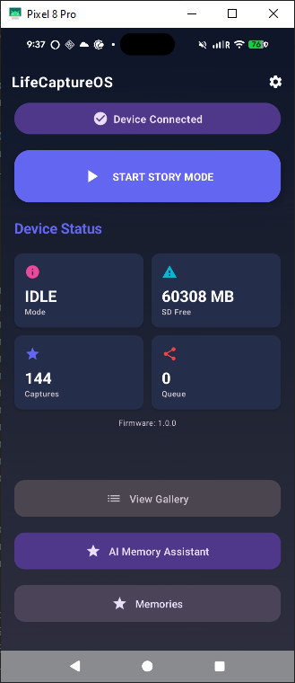
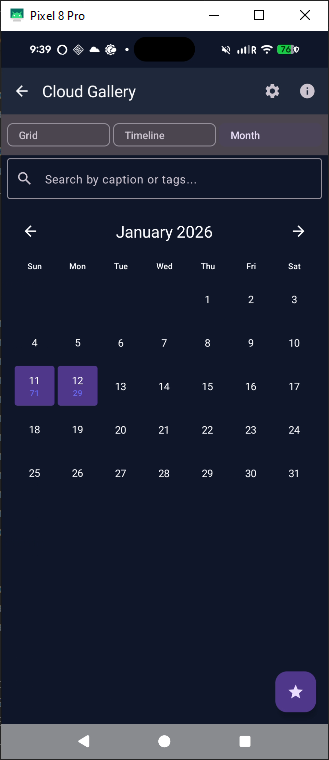
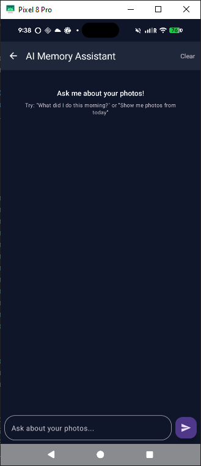
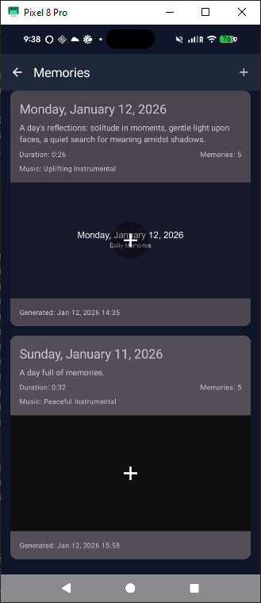
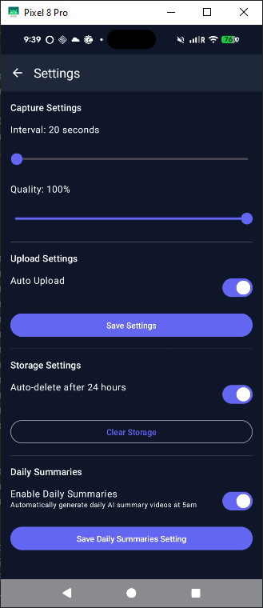
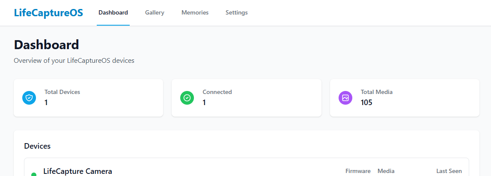
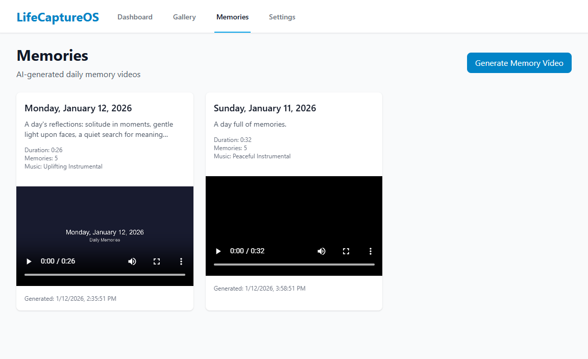
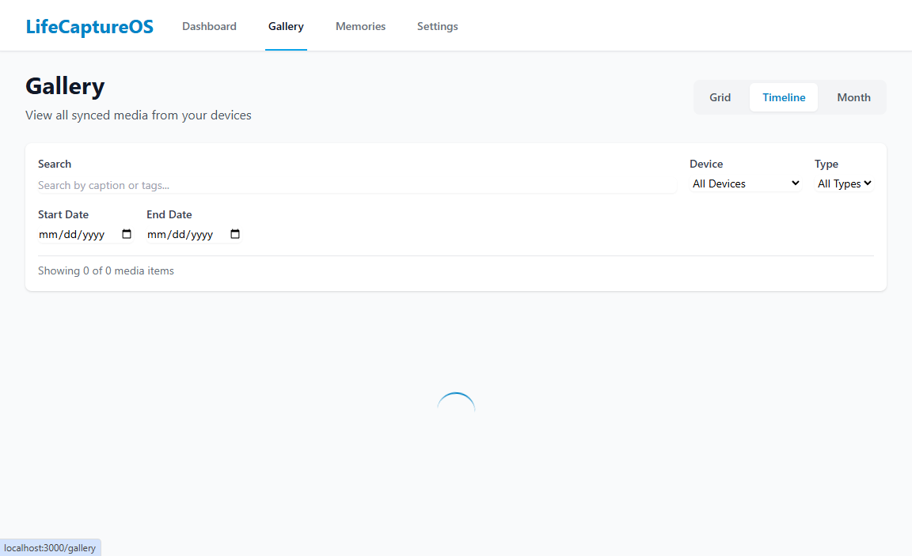
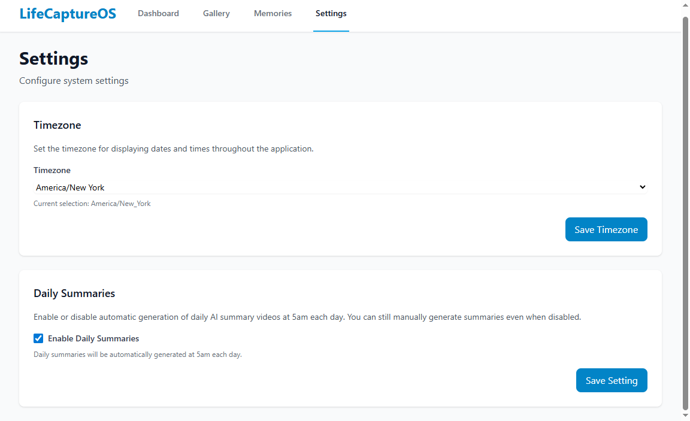

# LifeCaptureOS - ESP32-CAM Wearable Camera System

A production-minded MVP wearable camera system built with ESP32-CAM, Android, and a self-hostable backend with AI analysis.

## Architecture Overview

```
┌─────────────────┐         BLE (Provisioning,        ┌──────────────────┐
│   ESP32-CAM     │◄────────Control, Thumbnails)──────►│  Android Phone   │
│   + SD Card     │                                    │   (Kotlin App)   │
└────────┬────────┘                                    └──────────────────┘
         │
         │ Wi-Fi (Direct Upload)
         │ Full-res images/videos
         ▼
┌─────────────────┐         HTTP API                  ┌──────────────────┐
│  Backend Server │─────────────────────────────────►│  Remote Ollama   │
│   (FastAPI)     │         (moondream vision)        │   (AI Analysis)  │
└─────────────────┘                                    └──────────────────┘
```

## User Interface

### 📱 Android Application
A modern, dark-themed mobile experience for device management and memory traversal.

| Dashboard | Gallery | AI Assistant |
|:---:|:---:|:---:|
|  |  |  |
| *Real-time status & control* | *Smart calendar browsing* | *Natural language search* |

| Daily Memories | Settings |
|:---:|:---:|
|  |  |
| *Automated video recaps* | *BLE & Backend config* |

### 🖥️ Web Dashboard
Powerful desktop interface for system-wide overview and detailed AI analysis.

| Overview Dashboard | Semantic AI Memories |
|:---:|:---:|
|  |  |
| *Multi-device management* | *AI-summarized highlights* |

| Gallery Browser | System Settings |
|:---:|:---:|
|  |  |
| *High-res media grid* | *Global configuration* |

### Key Design Principles

1. **BLE is for control only**: Provisioning, commands, status, and thumbnail browsing
2. **Wi-Fi is for data**: Full-resolution uploads directly from ESP32 to backend
3. **Local-first**: All captures stored on SD with thumbnails and metadata
4. **Offline-tolerant**: Queue and retry uploads; device works without connectivity
5. **Security baseline**: BLE pairing + session tokens; device token auth for uploads
6. **AI-driven memories**: Automatic image analysis using `moondream`
7. **Automated Storytelling**: Scheduled daily highlight videos with music/transitions
8. **Semantic Search**: AI Chat for natural language memory retrieval

## Components

### 📷 Firmware (`firmware/`)
ESP32-CAM firmware (ESP-IDF via PlatformIO) that:
- Captures photos/videos on interval (Story Mode)
- Stores on SD in organized DCIM structure with thumbnails + metadata
- Exposes BLE GATT service for provisioning and control
- Uploads full-res media to backend over Wi-Fi with resumable sessions

### 📱 Android App (`android/`)
Kotlin app with Jetpack Compose that:
- Onboards device via BLE (Wi-Fi creds, backend URL, tokens)
- Browses local timeline using thumbnails over BLE
- Controls capture (start/stop, settings)
- Shows device status (SD free, upload queue, connectivity)

### 🖥️ Backend (`backend/`)
FastAPI server that:
- Receives resumable chunked uploads from ESP32
- Stores media with filesystem + SQLite metadata
- Integrates with local Ollama for image analysis and chat
- Generates daily recap videos using FFmpeg and AI summaries
- Provides REST API for app, web dashboard, and AI chat

## Quick Start

### Prerequisites
- **ESP32-CAM**: with 64GB microSD card
- **Android**: Phone with BLE support, Android 8.0+
- **Backend**: Linux/macOS/Windows with Python 3.11+
- **Ollama**: Running remotely with moondream model

### 1. Setup Backend

```bash
cd backend
python -m venv venv
source venv/bin/activate  # Windows: venv\Scripts\activate
pip install -r requirements.txt

# Configure
cp .env.example .env
# Edit .env: set OLLAMA_BASE_URL to your remote Ollama instance

# Run
python -m app.main
# Server runs on http://localhost:8000
```

### 2. Flash Firmware

Please follow the detailed [Firmware Flashing Guide](docs/FIRMWARE_FLASHING.md) for the streamlined PlatformIO setup.
Flash:
```bash
cd firmware
# Use PlatformIO to flash and monitor
pio run -t upload -t monitor
```

### 3. Build Android App

```bash
cd android
./gradlew assembleDebug
# Install APK from android/app/build/outputs/apk/debug/
```

### 4. Onboard Device

1. Open Android app
2. Scan for "LifeCaptureOS-XXXX" device
3. Pair and bond
4. Enter Wi-Fi credentials
5. Enter backend URL (e.g., `http://192.168.1.100:8000`)
6. Enter device token (See [Device Setup Guide](docs/DEVICE_SETUP.md) to generate yours)
7. Start capturing!

## Documentation

- [Device Setup Guide](docs/DEVICE_SETUP.md) - How to generate device tokens
- [Firmware Flashing Guide](docs/FIRMWARE_FLASHING.md) - Detailed ESP32-CAM flashing instructions
- [Web UI Guide](docs/WEB_UI_GUIDE.md) - React dashboard setup and build
- [AI Features Guide](docs/AI_FEATURES_GUIDE.md) - Memories, Day summaries, and AI Chat
- [BLE Protocol Specification](docs/BLE_PROTOCOL.md) - GATT service, commands, payloads
- [Upload API Specification](docs/UPLOAD_API.md) - Resumable upload design, auth
- [Firmware Guide](firmware/README.md) - Building, flashing, SD structure
- [Android Guide](android/README.md) - Building, BLE implementation
- [Backend Guide](backend/README.md) - Setup, API docs, Ollama integration

## Project Structure

```
lifecaptureos/
├── firmware/           # ESP32-CAM PlatformIO project
│   ├── main/
│   │   ├── ble_service.c       # GATT service implementation
│   │   ├── camera_capture.c    # Capture + thumbnail generation
│   │   ├── sd_storage.c        # SD card management
│   │   ├── wifi_upload.c       # Resumable upload client
│   │   └── main.c              # Main entry point
│   ├── CMakeLists.txt
│   └── README.md
├── android/            # Kotlin Android app
│   ├── app/
│   │   └── src/main/
│   │       ├── java/com/charles/LifeCaptureOS/
│   │       │   ├── ble/            # BLE manager
│   │       │   ├── ui/             # Compose UI
│   │       │   └── data/           # Models, repos
│   │       └── res/
│   ├── build.gradle.kts
│   └── README.md
├── backend/            # FastAPI backend
│   ├── app/
│   │   ├── main.py             # FastAPI app
│   │   ├── models.py           # SQLAlchemy models
│   │   ├── upload_service.py   # Resumable upload logic
│   │   ├── ollama_service.py   # AI analysis integration
│   │   └── routers/
│   │       ├── device.py       # Device upload endpoints
│   │       └── media.py        # Media browsing endpoints
│   ├── requirements.txt
│   ├── .env.example
│   └── README.md
├── docs/               # Protocol specs
│   ├── BLE_PROTOCOL.md
│   └── UPLOAD_API.md
└── README.md           # This file
```

## Development Status

- [x] Protocol specifications
- [x] Backend with Ollama integration
- [x] Firmware (ESP32-CAM)
- [x] Android app
- [ ] End-to-end testing
- [ ] Production hardening

## License

MIT License - Build amazing things!

## Contributing

This is an MVP reference implementation. PRs welcome for:
- Bug fixes
- Performance improvements
- Additional features (e.g., encryption, cloud sync)
- Better error handling

Please maintain the production-minded MVP philosophy: simple, reliable, extensible.
